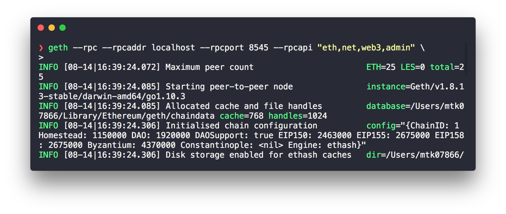
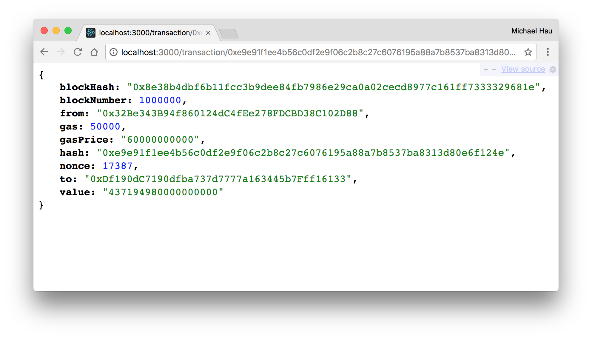

# Ethereum Hot Wallet

> A react-native hot wallet that communicates with geth node.

[![Travis][travis-badge]][travis]
[![Codecov Status][codecov-badge]][codecov]
[![license][license-badge]][license]

There are two parts in this monorepo application:

1. [RESTful Server](#server): A micro-service of geth RPC interface.
2. [Mobile](#mobile): React-native client.

## Demo

Screenshot:


## Technology Stack

- Micro - Micro HTTP server
- Create-react-native-app - Zero configuration
- Ant design - Native mobile UI
- Docker

## Setup

Download full node of the main Ethereum network on your computer:

```shell
$ brew tap ethereum/ethereum
$ brew install ethereum
$ geth --rpc --rpcaddr localhost --rpcport 8545 --rpcapi "eth,net,web3,admin"
> http://localhost:8545
```

> Add `admin` HTTP-RPC interface for web3.js.

Screenshot:



## Development

- node >= v10.8.0
- yarn >= 1.9.4

## Server

```shell
# Development
$ cd packages/server
$ cp .env.example .env # input your own config
$ npm run dev

# Production
$ npm run build
$ npm start

# or use docker
$ docker build -t ethereum-hot-wallet/server .
$ docker run --rm -it \
  -p 3000:3000 \
  -e "PORT=3000" \
  -e "DEBUG=server" \
  -e "NODE_RPC_DOMAIN=http://localhost:8545" \
  ethereum-hot-wallet/server
```

Endpoint example:

- http://localhost:3000/node
- http://localhost:3000/block/614060
- http://localhost:3000/transaction/0x4b6776c238213a86fa01852f6faeec4f38a4ca5248b488166abc1efef407da06
- http://localhost:3000/transaction/0xd6a80a88b9564aa7580b90ca2e5fec8da9d113f54370f86f72fcf0e40f05d131

> Rate-limiting 1 requests per sec.

| **Variable**    | **Default** | **Description**         |
| --------------- | ----------- | ----------------------- |
| PORT            |             |                         |
| DEBUG           |             | for npm debug           |
| NODE_RPC_DOMAIN |             | Domain name of geth RPC |

Screenshot:



---

## Mobile

```shell
$ cd packages/mobile
$ cp .env.example .env # input your own config
$ npm run ios
```

| **Variable** | **Default** | **Description**       |
| ------------ | ----------- | --------------------- |
| API_DOMAIN   |             | Domain name of server |

---

## CONTRIBUTING

- ⇄ Pull requests and ★ Stars are always welcome.
- For bugs and feature requests, please create an issue.
- Pull requests must be accompanied by passing automated tests.

## [LICENSE](LICENSE)

MIT: [http://michaelhsu.mit-license.org](http://michaelhsu.mit-license.org)

[travis-badge]: https://travis-ci.com/evenchange4/ethereum-hot-wallet.svg?branch=master
[travis]: https://travis-ci.org/evenchange4/ethereum-hot-wallet
[codecov-badge]: https://img.shields.io/codecov/c/github/evenchange4/ethereum-hot-wallet.svg?style=flat-square
[codecov]: https://codecov.io/github/evenchange4/ethereum-hot-wallet?branch=master
[license-badge]: https://img.shields.io/github/license/evenchange4/micro-website-api.svg?style=flat-square
[license]: http://michaelhsu.mit-license.org/
